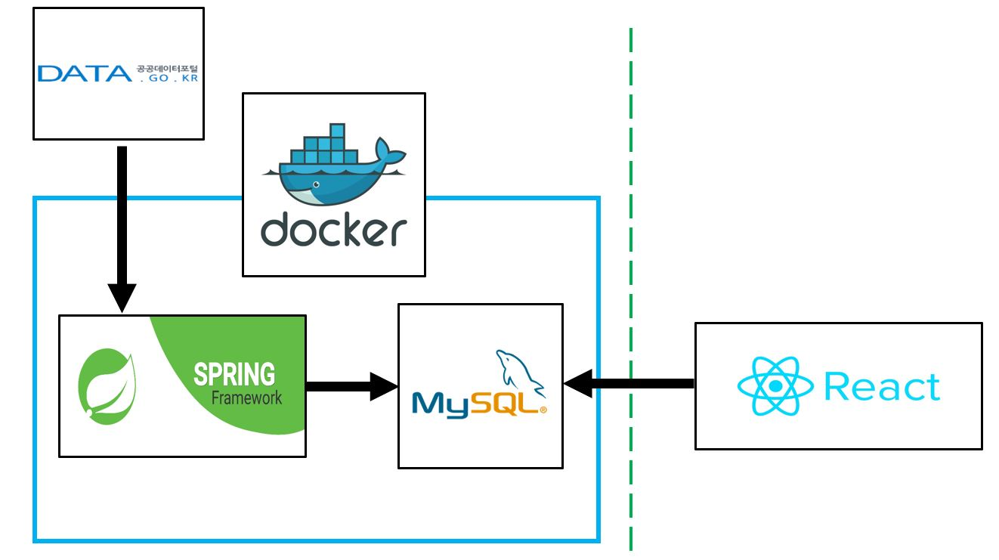

# 사전 과제 발표 자료

## 전체 시스템 구조도
 

**Back-end**
	Spring Framework(배치) + MySql(데이터 적재) + Docker(container)

**Front-end**
	React.js(데이터 출력)

- - -

## 주요 기능

### API 연동
: 건물관리대상 API 요청
: API 데이터 JSON 변환 및 Parsing

### Database 저장
: API 데이터 MySql에 저장

### Container wrapping 및 실행
: Docker로 Back-end단 Wrapping
: Docker hub 업로드 및 image 배포
: image 다운로드를 통한 실행 용이성 확보

### REST API 인증(Authentication)
: Front-end 로그인 시, JWT로 해당 계정의 토큰을 조회
: 인증 후 로그인 및 데이터 조회 가능
